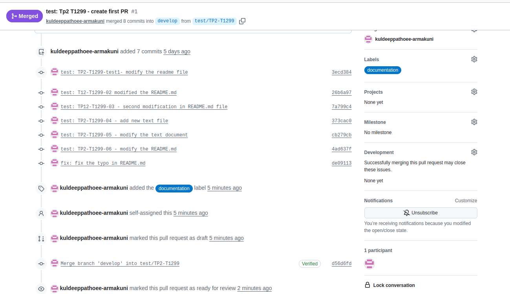
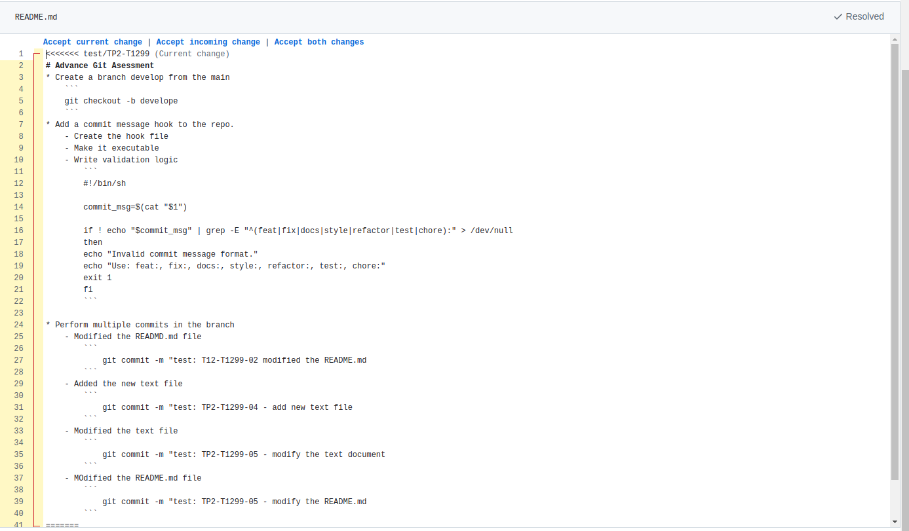
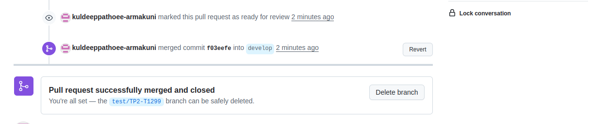

# Advance Git Assessment
## Test Cases
* Create a branch develop from the main
    ```
    git checkout -b develope 
    ```
* Add a commit message hook to the repo.
    - Create the hook file
    - Make it executable
    - Write validation logic
        ``` 
        #!/bin/sh

        commit_msg=$(cat "$1")

        if ! echo "$commit_msg" | grep -E "^(feat|fix|docs|style|refactor|test|chore):" > /dev/null
        then
        echo "Invalid commit message format."
        echo "Use: feat:, fix:, docs:, style:, refactor:, test:, chore:"
        exit 1
        fi
        ```
    
* Perform multiple commits in the branch
    - Modified the READMD.md file
        ``` 
            git commit -m "test: T12-T1299-02 modified the README.md
        ```
    - Added the new text file
        ```
            git commit -m "test: TP2-T1299-04 - add new text file
        ```
    - Modified the text file
        ```
            git commit -m "test: TP2-T1299-05 - modify the text document
        ```
    - MOdified the README.md file
        ```
            git commit -m "test: TP2-T1299-05 - modify the README.md
        ```
* Create PR to develop.

    - Create PR
    
    - Review differences
    
    - Merge and delete 
    
* Create another branch from develop given your previous PR is still in review state.
    ```
    git checkout -b test/tp12-t1299-new

    ```
* Now commit something in your current branch and push it
    ```
    git commit -m "test: TP2-T1299-07 - modify README.md

    ```
* Sync with develop (After PR Merge)
    ```
    git checkout develop
    git pull origin develop      # Get the newly merged changes
    git checkout test/tp12-t1299-new
    git merge develop            # Bring those changes into current branch
    git push origin test/tp12-t1299-new
    ```

